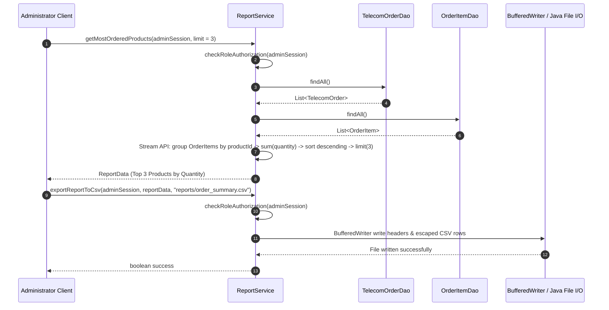

# Implementation Plan - Phase 9: Reporting, Analytics & Data Export Service

## 1. Baseline & Overview

### Completed Baseline (Phases 1–8)
The project baseline is committed at **`5a28ce2` — Phase 8 complete: Multithreading and Concurrency**.
- **Phase 1**: Established core functional specifications and role definitions.
- **Phase 2**: Relational schema with 16 normalized tables.
- **Phase 3**: Core domain models, enums, and exception hierarchy (`TelecomDomainException`).
- **Phase 4**: Pure JDBC infrastructure (`DatabaseConnection`, `JdbcTransactionManager`, `DatabaseException`) and DAO contracts for all 16 tables.
- **Phase 5**: Authentication & security services (`PasswordUtils`, `CaptchaService`, `OtpService`, `AuthenticationService`, `AuthorizationService`, `UserSession`).
- **Phase 6**: Customer, Product catalog, and Order strategy services (`CustomerService`, `ProductService`, `PricingStrategy` factory, `OrderService`).
- **Phase 7**: Transactional domain services (`PaymentService` with payment-inventory reservation transaction, `InventoryService` with thread-safe item reservation, `ProvisioningService` with engineer ranking, `ActivationService` with service activation transaction, `NotificationService`, `AuditService`).
- **Phase 8**: Multithreading, Concurrency, and Background Scheduling (`OrderProcessor`, `ProvisioningProcessor`, `InventoryMonitor`, `NotificationProcessor`, `OrderReportGenerator`, `SchedulerManager`).

### Phase 9 Goals
Phase 9 implements **Reporting, Analytics & Data Export Service** (`ReportService` & `ReportServiceImpl`) as specified in Section 17 ("Java 8 Requirements") and Section 20 ("Reports") of the case study PDF. The service exposes **25 API methods** covering order, inventory, provisioning, revenue analytics, and data exports.

---

## 2. Phase 9 Exact Functional Scope & Requirements

According to case study Sections 17 and 20, Phase 9 provides comprehensive system reporting across four key domain areas, using Java 8 Streams, Collectors, Lambdas, Comparators, and File I/O for CSV/TXT export:

### A. Order Analytics & Reports (8 Methods)
1. **Orders by Date Range**: Filter orders created between `startDate` and `endDate` (comparing `TelecomOrder.orderDate`).
2. **Orders by Product**: Count orders containing each `TelecomProduct`.
3. **Most Ordered Products**: Top N most frequently ordered products. Ranking is determined by summing `OrderItem.quantity` across all orders for each `productId` (i.e. `sum(OrderItem.quantity)`).
4. **Orders by Status**: Group orders by `OrderStatus` and compute counts.
5. **Orders by Customer Type**: Group orders by `CustomerType` (INDIVIDUAL, SME, ENTERPRISE).
6. **Cancelled Orders**: List orders with status `CANCELLED`.
7. **Failed Orders**: List orders with status `FAILED`.
8. **Average Order Processing Time**: Average duration in minutes for orders with `orderStatus == ACTIVATED` or `COMPLETED`.
   - **Timestamp Clarification**: `TelecomOrder` does not have a separate `activatedAt` column. `updatedAt` is updated during activation/completion in `ActivationServiceImpl` and represents the best available existing timestamp approximation for activation/completion.
   - **Formula**:
     $$\text{Duration} = \text{Duration.between}(order.getOrderDate(), order.getUpdatedAt() != null ? order.getUpdatedAt() : order.getOrderDate()).toMinutes()$$

### B. Inventory Analytics & Reports (5 Methods)
1. **Available Inventory**: List/count inventory items with `status == InventoryStatus.AVAILABLE`.
2. **Reserved Inventory**: List/count inventory items with `status == InventoryStatus.RESERVED`.
3. **Inventory by Warehouse**: Group inventory items by warehouse location (Mumbai, Delhi, Pune, etc.).
4. **Low Inventory Detection**: Identify `(warehouse, itemType)` combinations where available stock < threshold.
5. **Damaged Inventory**: List damaged items requiring replacement or repair (`status == InventoryStatus.DAMAGED`).

### C. Provisioning Analytics & Reports (5 Methods)
1. **Successful Provisioning Requests**: Filter requests with `status == ProvisioningStatus.SUCCESS`.
2. **Failed Provisioning Requests**: Filter requests with `status == ProvisioningStatus.FAILED`.
3. **Provisioning by Service Type**: Group requests by `ProvisioningType` (`SIM_ACTIVATION`, `ESIM_ACTIVATION`, `BROADBAND`, `VPN`, etc.).
4. **Average Provisioning Time**: Average duration in minutes for requests with `status == ProvisioningStatus.SUCCESS`, calculated using existing model timestamp fields:
   $$\text{Duration} = \text{Duration.between}(request.getRequestedDate(), request.getCompletedDate()).toMinutes()$$
5. **Engineer Workload & Utilization**: Rank engineers by `activeTasks` and specialization.

### D. Revenue Analytics & Reports (5 Methods - Strict BigDecimal Aggregation)
All monetary aggregations strictly use `BigDecimal` addition/reduction (no `summingDouble`):
1. **Product-wise Revenue**: Total revenue generated per product, aggregating `OrderItem.totalAmount` (using `unitPrice * quantity` as fallback if `totalAmount` is null).
2. **Monthly Revenue**: Total revenue grouped by `YearMonth` / month, aggregating `TelecomOrder.totalAmount`.
3. **Customer-Type Revenue**: Breakdown of total revenue by `CustomerType`, aggregating `TelecomOrder.totalAmount`.
4. **Payment Mode Analysis**:
   - Filter `OrderPayment` rows to include **ONLY** payments with `status == PaymentTransactionStatus.SUCCESS`.
   - Group by `PaymentMode` (`CARD`, `UPI`, `NET_BANKING`, `BANK_TRANSFER`).
   - Count successful payments and aggregate total monetary amounts using `BigDecimal` addition.
5. **Top Customers by Revenue**: Top N customers sorted descending by total monetary spending (`sum(TelecomOrder.totalAmount)`).

### E. Data Export (2 Methods - Standard Core Java CSV & Text File Handling)
1. **CSV Export (`exportReportToCsv`)**: Formats `ReportData` into standard comma-separated text format and writes to file path using `BufferedWriter` / Java File I/O.
   - **Standard Core Java CSV Escaping Rules**:
     - `null` values are exported as empty string `""`.
     - Values containing commas `,`, double quotes `"`, or line breaks (`\n`, `\r`) are wrapped in double quotes `"..."`.
     - Any embedded double quotes `"` inside values are escaped as doubled double quotes `""`.
     - No external CSV libraries used.
2. **TXT Export (`exportReportToText`)**: Formats `ReportData` into clean, human-readable text tables and writes to file path using `BufferedWriter` / Java File I/O.

---

## 3. Security, Authorization & Sessions

Generating system-wide reports and analytics requires administrative privileges:
- Methods check `session.hasRole(RoleCode.ORDER_ADMINISTRATOR)` or `session.hasRole(RoleCode.INVENTORY_ADMINISTRATOR)`.
- If session is `null` or user lacks administrative roles, `AccessDeniedException` is thrown.

---

## 4. Architecture & Component Relationships

```
 [ Client / Admin ]
        |
        v
 +-------------------------------------------------------------------+
 |                          ReportService                            |
 |                      (ReportServiceImpl)                          |
 +-------------------------------------------------------------------+
    |        |          |            |           |            |           |
    v        v          v            v           v            v           v
 OrderDAO ProductDAO OrderItemDAO CustomerDAO InventoryDAO ProvisioningDAO PaymentDAO
    |        |          |            |           |            |           |
    +--------+----------+------------+-----------+------------+-----------+
                                     |
                                     v (Java 8 Streams / Collectors / Comparators)
                                     |
                                ReportData DTO
                                     |
                                     v (BufferedWriter / Java File I/O)
                            CSV / TXT File Reports
```

---

## 5. File Plan

### New Files to Create (4 files)

#### Package: `com.amdocs.telecom.report`
1. [`src/com/amdocs/telecom/report/ReportData.java`](file:///c:/Users/adity/Documents/ChatGPT/Java%20Project/src/com/amdocs/telecom/report/ReportData.java) [NEW]
   - DTO container storing report title, headers (`List<String>`), rows (`List<List<String>>`), generated timestamp, and summary metrics.

#### Package: `com.amdocs.telecom.service`
2. [`src/com/amdocs/telecom/service/ReportService.java`](file:///c:/Users/adity/Documents/ChatGPT/Java%20Project/src/com/amdocs/telecom/service/ReportService.java) [NEW]
   - Interface defining all 25 reporting, analytical stream operations, and file export methods.

#### Package: `com.amdocs.telecom.service.impl`
3. [`src/com/amdocs/telecom/service/impl/ReportServiceImpl.java`](file:///c:/Users/adity/Documents/ChatGPT/Java%20Project/src/com/amdocs/telecom/service/impl/ReportServiceImpl.java) [NEW]
   - Core implementation using Java 8 Stream API, DAO queries, role authorization checks, and `BufferedWriter` / Java File I/O with standard CSV escaping.

#### Test Package: `com.amdocs.telecom.service`
4. [`tests/com/amdocs/telecom/service/ReportServiceTest.java`](file:///c:/Users/adity/Documents/ChatGPT/Java%20Project/tests/com/amdocs/telecom/service/ReportServiceTest.java) [NEW]
   - Unit and integration test suite testing all 25 report queries, Java 8 Stream operations, security checks, and CSV/TXT file exports with content reading assertions.

### Modified Files
- **`NONE`**. Zero Phase 1–8 source files will be modified.

---

## 6. Sequence Diagram

### Example Report Generation & CSV Export Flow


---

## 7. Verification & Test Plan

### Automated Tests
1. **Compilation**: `javac --release 8 -cp "lib/*" -d out ...`
2. **Phase 9 ReportService Tests (`ReportServiceTest`)**:
   - Test all 25 ReportService methods explicitly.
   - Assert Order Reports (Orders by date range, orders by product, top N products by total quantity, orders by status, orders by customer type, cancelled orders, failed orders, average processing time using `orderDate` and `updatedAt`).
   - Assert Inventory Reports (Available inventory, reserved inventory, inventory by warehouse, low inventory detection, damaged stock).
   - Assert Provisioning Reports (Successful provisioning, failed provisioning, provisioning by service type, average provisioning time using `requestedDate` and `completedDate`, engineer workload).
   - Assert Revenue Reports (Product-wise revenue via `BigDecimal` reduction on `OrderItem.totalAmount`, monthly revenue, customer-type revenue, payment mode analysis for `PaymentTransactionStatus.SUCCESS` payments, top customers by spending).
   - Assert Security/Authorization (Ensure customer session receives `AccessDeniedException`).
   - Assert Data Export (Read generated CSV file back to verify quote/comma/newline escaping and read generated TXT file back to verify report title/headers).
3. **Phase 5 Security Regression Tests**:
   - `PasswordUtilsTest`, `CaptchaServiceTest`, `OtpServiceTest`, `AuthenticationServiceTest`.
4. **Phase 6 Workflow Regression Tests**:
   - `CustomerServiceTest`, `ProductServiceTest`, `OrderServiceTest`.
5. **Phase 7 Transaction Regression Tests**:
   - `InventoryServiceTest`, `PaymentServiceTest`, `ProvisioningServiceTest`, `ActivationServiceTest`.
6. **Phase 8 Scheduler Regression Tests**:
   - `NotificationProcessorTest`, `ProvisioningProcessorTest`, `OrderProcessorTest`, `InventoryMonitorTest`, `SchedulerManagerTest`.
7. **Integration Smoke Test**: `DaoIntegrationSmokeTest`.
8. **Git Verification**: `git diff --check` and `git status`.

---

## 8. Open Questions & Decisions Requiring Approval

1. **Export Directory Auto-creation**:
   - `ReportServiceImpl` will automatically invoke `file.getParentFile().mkdirs()` if the target directory (e.g. `reports/`) does not exist yet.
2. **Monetary Precision**:
   - All revenue calculations strictly use `BigDecimal` addition/reduction and preserve scale of 2 decimal places (`RoundingMode.HALF_UP`).
